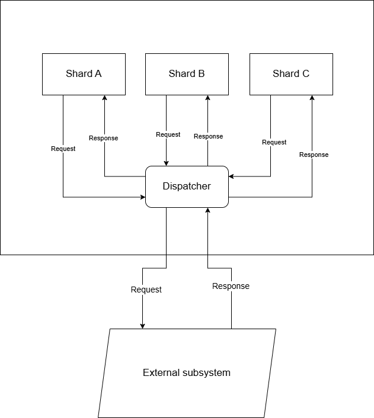

# Dynamic-kafka-listener

####  Описание 
Необходимо реализовать функциональность по вычитыванию массива конфигураций (кафок + топиков в них) и созданию на основании этого массива kafka listener'ов и kafka template в spring-kafka.
Для подключения нового кластера в сервис необходимо будет лишь добавить ещё один элемент в массиве и перезапустить сервис.
Соответственно создание kafka listener должно быть не в декларативном стиле (через аннотацию @KafkaListener), а в императивном. Ведь сколько кафка слушателей потребуется и для каких брокеров будет понятно только в runtime.

####  Рассмотренные варианты реализации: 
1. Для каждой шарды задаётся отдельный конфиг KafkaProperties. Это может быть полезно для более тонкой настройки kafka для каждой шарды  
   (personal-kafka-config-for-each-shard)
2. Задаются общие kafka properties для всех шард. Меньше конфигов, но меньше и гибкости  
   (one-kafka-config-for-all-shards)

####  Причины создания 
Такая функциональность может быть полезна в различных ситуациях, например, для объединения идентичных потоков сообщений из разных источников для внешней интеграции.
Например, у вас есть шардированная архитектура, где вы делите нагрузку между разными шардами с их собственными кафками, БД и т.д. 
Так, маршрутизируя входящие запросы на разные шарды вы снижаете нагрузку на каждую БД и получаете большую отказоустойчивость.  
Однако, если у вас есть внешние интеграции, то этой системе придётся интегрироваться с каждой из ваших шард, что неудобно. Во-первых, неудобной получается сама интеграция (ведь вместо 1 интеграции количество ваших интеграций = кол-ву шард). Во-вторых, расширить количество шард, при необходимости также сложнее т.к. нужно будет согласовать добавление новых интеграций во внешних системах и подождать их реализацию.
Вместо этого можно объединять потоки сообщений с разных шард для внешней интеграции, а при получении ответов для шард обратно маршрутизировать их в конкретные шарды.

 `Реализации разделены по веткам, в main ветку слиты все ветки. Конкретные реализации нужно смотреть по отдельным веткам.`

###   Немного используемой теории по сущностям spring-kafka и их связям друг с другом 
#### 1. DefaultKafkaConsumerFactory
**Описание  **
   Это фабрика, которая используется для создания и настройки экземпляров Kafka-потребителей (KafkaConsumer).
   Она принимает Map<String, Object> с настройками, которые передаются в KafkaConsumer.
   Реализует интерфейс ConsumerFactory.
**  Примеры того, что можно настраивать  **
* Основные настройки Kafka-потребителя:
  * bootstrap.servers — адреса брокеров Kafka.
  * group.id — идентификатор группы потребителей.
  * key.deserializer — десериализатор для ключа сообщения (например, StringDeserializer).
  * value.deserializer — десериализатор для значения сообщения (например, JsonDeserializer).
  * auto.offset.reset, enable.auto.commit, max.poll.records
* Настройки для JsonDeserializer:
  * spring.json.trusted.packages — доверенные пакеты для десериализации JSON.
  * spring.json.value.default.type — тип по умолчанию для десериализации JSON.

####  2. ConcurrentKafkaListenerContainerFactory
**Описание  **
ConcurrentKafkaListenerContainerFactory является фабрикой и используется для создания контейнеров (ConcurrentMessageListenerContainer), которые управляют Kafka-потребителями.
Эти контейнеры запускают несколько потоков для обработки сообщений из Kafka.
Она использует ConsumerFactory для создания kafka-потребителей и может донастраивать их поведение.
**  Примеры того, что можно настраивать  **
* Количество потоков (concurrency).
   Указывает, сколько потоков будет обрабатывать сообщения. Например, если concurrency = 3, то будет создано 3 потока для обработки сообщений.
* Поведение контейнера:
  * setAutoStartup(boolean autoStartup) — указывает, должен ли контейнер запускаться автоматически.
  * setAckMode(ContainerProperties.AckMode ackMode) — настраивает режим подтверждения (например, RECORD, BATCH, MANUAL).
  * setBatchListener(true) — включает режим пакетной обработки сообщений.
* Обработку ошибок:
  * setErrorHandler(ErrorHandler errorHandler) — указывает обработчик ошибок
  * setRetryTemplate(RetryTemplate retryTemplate) — настраивает повторные попытки обработки сообщений.

####  3. ConcurrentMessageListenerContainer
**Описание  **
Это контейнер, который непосредственно управляет Kafka-потребителями и запускает их в нескольких потоках. Он создается с помощью ConcurrentKafkaListenerContainerFactory.
Реализует интерфейс MessageListenerContainer и которая запускает несколько экземпляров KafkaMessageListenerContainer (по одному на каждый поток).
**  Примеры того, что можно настраивать  **
В целом настраивает контейнер ConcurrentKafkaListenerContainerFactory, но можно и вручную переопределить его параметры
* Количество потоков (concurrency)
* Поведение контейнера (Настраивается через ContainerProperties):
  * setAckMode(ContainerProperties.AckMode ackMode) — режим подтверждения.
  * setMessageListener(MessageListener<?, ?> messageListener) — устанавливает обработчик сообщений.
  * setPollTimeout(long timeout) — таймаут для опроса Kafka.

####  4. MethodKafkaListenerEndpoint
**Описание  **
Используется для настройки конечной точки (endpoint) для обработки сообщений Kafka. Kafka-endpoint описывает, как обрабатывать сообщения из Kafka.
Он связывает метод (через рефлексию) с топиком Kafka. Реализует интерфейс KafkaListenerEndpoint.

**  Примеры того, что можно настраивать  **
* Топики (из каких топиков читать сообщения)
* Группу потребителей
* Метод обработки (указывает метод, который будет вызываться для обработки сообщений. При использовании @KafkaListener это будет метод, над которым висит аннотация)
* id — уникальный идентификатор конечной точки.
* concurrency — количество потоков для обработки здесь тоже можно задать
* errorHandler - обработчик ошибок здесь тоже можно задать

####  Связь между этими классами
1. DefaultKafkaConsumerFactory создает kafka-потребителей.
2. ConcurrentKafkaListenerContainerFactory использует DefaultKafkaConsumerFactory при создании контейнеров (ConcurrentMessageListenerContainer) для создания kafka-потребителей.
3. ConcurrentMessageListenerContainer управляет KafkaMessageListenerContainer'ами т.е. управляет потоками для обработки сообщений.
4. KafkaMessageListenerContainer управляет kafka-потребителем
5. MethodKafkaListenerEndpoint связывает метод для обработки с топиками kafka, указывая как обрабатывать сообщения.
6. KafkaListenerEndpointRegistry связывает kafka-endpoint с ConcurrentKafkaListenerContainerFactory. 
   Т.е. связывает топик + указание какой метод вызывать для обработки сообщения из этого топика с фабрикой, которая создаст контейнеры. 
   Контейнеры же будут используя kafka-потребители получать из указанных в kafka-endpoint топиков сообщения и вызывать метод для из обработки, указанные в kafka-endpoint